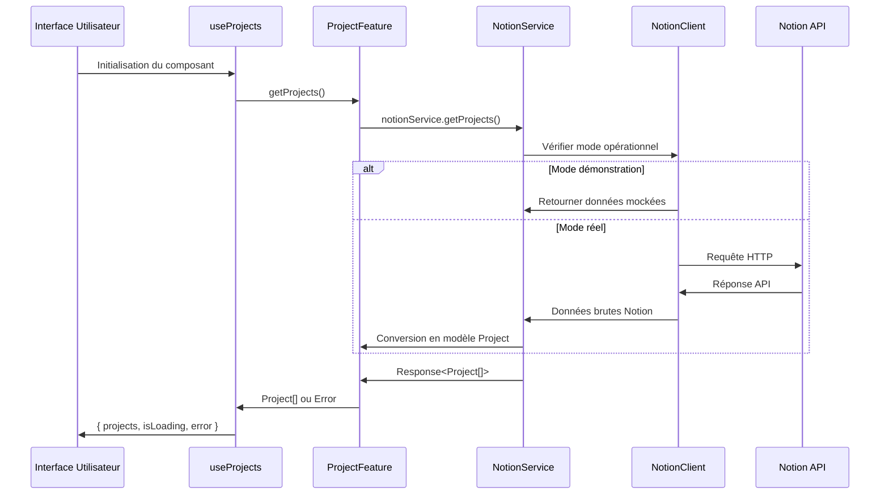
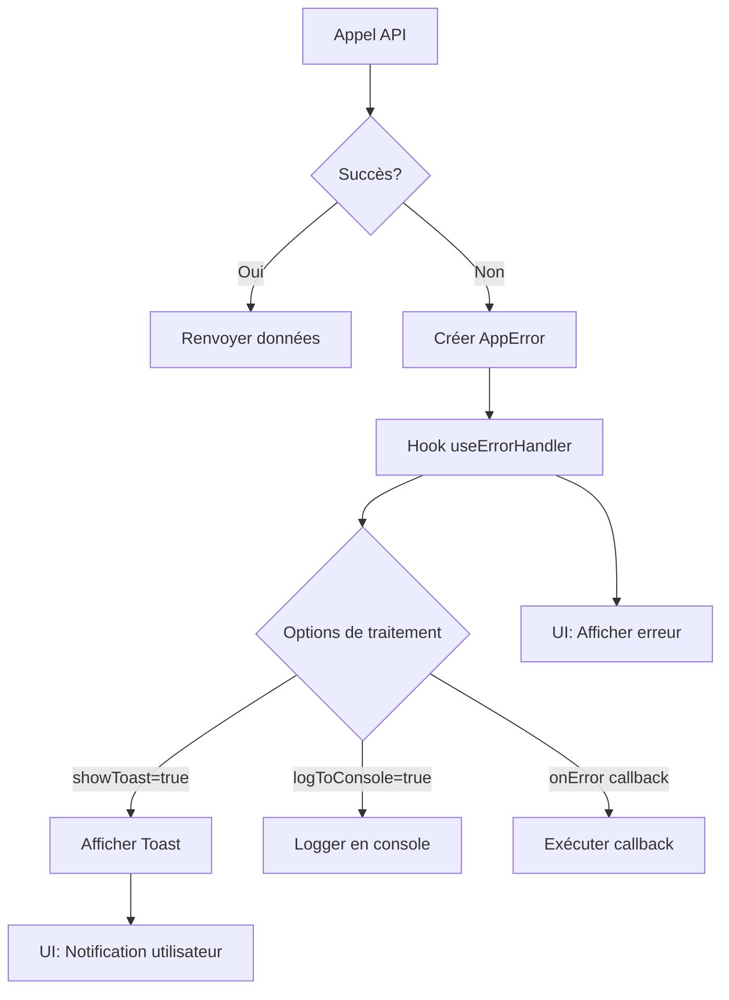
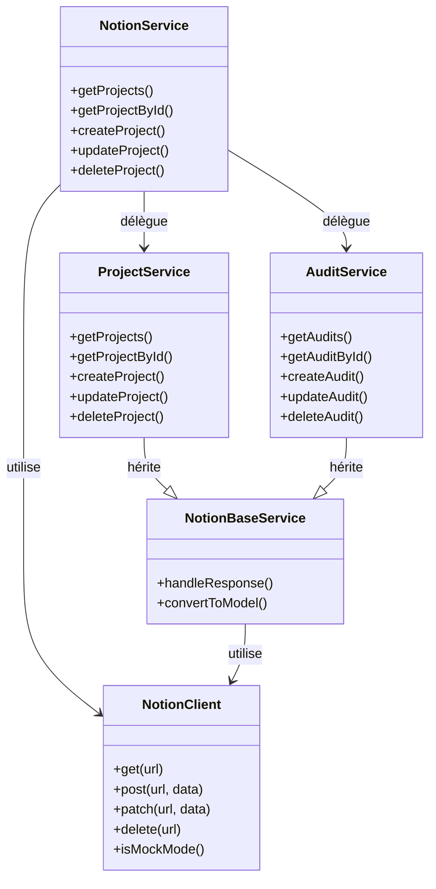
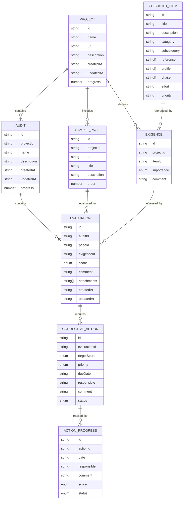

# Documentation des flux de données

Ce document décrit les principaux flux de données dans l'application d'audit d'accessibilité.

## Flux de récupération de projets

## Flux de gestion des erreurs

## Architecture des services Notion

## Modèle de données

